# 🏭 StrategyEngine AI 

### Autonomous Multi-Agent Business Intelligence System


---

## 🚀 What is StrategyEngine AI?

**StrategyEngine AI** is an autonomous Data Science department powered by AI. Upload a CSV, describe your business objective, and a team of **13 specialized AI agents** — orchestrated by **LangGraph** and powered by **Gemini, OpenRouter, MIMO, and other LLMs** — collaborates end-to-end to deliver executive-ready business intelligence reports.

No notebooks. No manual tuning. No code. Just strategic insights.

The system audits your data for quality issues, formulates analytical strategies, generates and executes production-grade machine learning code in a sandbox, validates results through multiple review gates, and translates technical metrics into actionable business recommendations — all autonomously.

---

## 🏗️ Architecture



```mermaid
graph LR
    User["CSV + Business Goal"] --> Steward

    subgraph Foundry ["The Insight Foundry"]
        Steward["Data Steward"] --> Strategist["Strategist"]
        Strategist --> DomainExpert["Domain Expert"]
        DomainExpert --> ExecPlanner["Execution Planner"]
        ExecPlanner --> DataEng["Data Engineer"]
        DataEng --> MLEng["ML Engineer"]
        MLEng --> Reviewer["Code Reviewer"]
        Reviewer --> QA["QA Gate"]
        QA --> ResultsAdv["Results Advisor"]
        ResultsAdv --> ReviewBoard["Review Board"]
        ReviewBoard --> Translator["Business Translator"]
    end

    Translator --> Report["Executive Report + PDF"]

    style Strategist fill:#e1bee7,stroke:#6a1b9a,stroke-width:2px
    style ReviewBoard fill:#bbdefb,stroke:#1565c0,stroke-width:2px
    style MLEng fill:#c8e6c9,stroke:#2e7d32,stroke-width:2px
```

> The pipeline includes **retry loops** for the ML Engineer (up to 6 iterations) and **conditional routing** when code fails validation or execution.

---

## 🤖 The Agent Team

The system mirrors a high-performing human data organization with **13 specialized agents**, each with a distinct role:

### Core Pipeline

| Agent | Role | LLM |
|-------|------|-----|
| **👮 Data Steward** | Ingests, audits, and samples raw data. Detects encoding issues, missing values, and anomalies using composite head+tail+random sampling. | Gemini |
| **🧠 Strategist (CDO)** | Formulates 1–3 optimal analytical strategies based on the data profile and business objective. | Gemini 3 Flash |
| **🎯 Domain Expert** | Scores and selects the best strategy evaluating business alignment, feasibility, and data sufficiency. | MIMO v2 Flash |
| **📋 Execution Planner** | Designs the execution blueprint: dataset profile, plot specifications, timeout settings, and resource plan. | Gemini |
| **🔧 Data Engineer** | Generates cleaning and transformation scripts to prepare data for modeling. | OpenRouter |
| **🛠️ ML Engineer** | Writes production-ready Scikit-Learn code with imputation, encoding, feature engineering, and model training. | OpenRouter / Z.ai / DeepSeek |
| **📝 Code Reviewer** | Static analysis and safety scanning of generated code before execution. | Gemini |
| **✅ QA Gate** | Enforces quality assertions with HARD/SOFT severity rules on outputs and metrics. | Gemini |
| **📊 Results Advisor** | Analyzes model performance and generates improvement recommendations. | MIMO |
| **🏛️ Review Board** | Final decision authority — approves, rejects, or flags results with limitations. | Gemini |
| **💼 Business Translator** | Converts technical metrics (accuracy, F1, AUC) into ROI impact, business risks, and strategic next steps. | Gemini |

### Support Agents

| Agent | Role |
|-------|------|
| **🔍 Cleaning Reviewer** | Validates data transformation integrity after cleaning scripts run. |
| **🐛 Failure Explainer** | Diagnoses runtime errors and proposes targeted fixes for retry iterations. |

---

## ✨ Key Features

### Multi-LLM Orchestration
The system intelligently routes tasks to the best LLM for each job. Supports **6 providers** with automatic fallback chains:
- **Google Gemini** — Strategic reasoning and planning
- **OpenRouter** — Code generation with primary + fallback model support
- **Z.ai (GLM-4.7)** — Alternative ML code generation
- **DeepSeek** — Deep reasoning tasks
- **MIMO (Xiaomi)** — Domain expertise and results analysis
- **Kimi (Moonshot)** — Additional code generation capacity

### Self-Healing ML Pipelines
The ML Engineer operates in a **retry loop of up to 6 iterations**. When code fails execution or validation, the Failure Explainer diagnoses the issue and the engineer generates a corrected version — autonomously.

### Contract-Driven Validation
An **Execution Contract v4.1** governs every run: column role mapping, derived column rules, QA gate assertions (HARD/SOFT severity), reviewer gates, and artifact requirements. Nothing ships without passing the contract.

### Sandboxed Code Execution
All generated code runs in an **isolated sandbox** (E2B or CloudRun) with automatic dependency installation, configurable timeouts per data scale (60s–300s), and transient error retry logic.

### Real-Time Execution Dashboard
A live Streamlit dashboard shows:
- **Pipeline progress** with a 7-stage visual tracker
- **Elapsed time** counter
- **ML iteration badge** (e.g., "Iteration 3/6 — F1: 0.82")
- **Activity log** with timestamped agent messages
- **Sidebar status panel** with current stage and metrics

### Business-First Output
The system doesn't stop at `Accuracy: 0.85`. The Business Translator converts every metric into business language — estimated ROI, risk assessment, confidence intervals, and prioritized action items — delivered as a **downloadable PDF report**.

### Enterprise Integrations
- **CRM Connectors**: Salesforce and HubSpot integration for direct data ingestion
- **Excel Support**: Automatic Excel-to-CSV conversion
- **PII Scrubbing**: Sensitive data masking before processing

---

## 🛠️ Installation & Usage

### 1. Clone the Repository
```bash
git clone https://github.com/santiagoLagowormo/the-insight-foundry.git
cd the-insight-foundry
```

### 2. Install Dependencies
```bash
pip install -r requirements.txt
```

### 3. Configure Environment

Create a `.env` file in the root directory:

```env
# Required: Google Gemini (core reasoning)
GOOGLE_API_KEY=your_api_key_here
```

**Optional LLM providers** for the ML Engineer and other agents:

```env
# OpenRouter (recommended for ML Engineer — supports primary + fallback)
ML_ENGINEER_PROVIDER=openrouter
OPENROUTER_API_KEY=your_api_key_here
OPENROUTER_ML_PRIMARY_MODEL=moonshotai/kimi-k2.5
OPENROUTER_ML_FALLBACK_MODEL=z-ai/glm-4.7
OPENROUTER_TIMEOUT_SECONDS=120

# Z.ai / GLM (alternative ML Engineer provider)
# ML_ENGINEER_PROVIDER=zai
# ZAI_API_KEY=your_api_key_here
# ML_ENGINEER_MODEL=glm-4.7
# GLM_MAX_CONCURRENCY=2

# MIMO (Domain Expert & Results Advisor)
MIMO_API_KEY=your_api_key_here

# DeepSeek (optional reasoning provider)
# DEEPSEEK_API_KEY=your_api_key_here
```

### 4. Run The Insight Foundry
```bash
streamlit run app.py
```

---

## 📊 How It Works

```
1. Upload     → You provide a CSV file and describe your business goal
2. Audit      → Data Steward profiles the data, detects issues, samples intelligently
3. Strategize → Strategist generates analytical approaches; Domain Expert selects the best
4. Plan       → Execution Planner designs the full ML execution blueprint
5. Clean      → Data Engineer generates transformation scripts, validated by Cleaning Reviewer
6. Build      → ML Engineer writes and iterates on ML code (up to 6 attempts)
7. Validate   → Code Reviewer + QA Gate + Review Board enforce quality standards
8. Translate  → Business Translator converts results into executive-ready insights
9. Deliver    → PDF report with metrics, visualizations, and strategic recommendations
```

---

## 🧪 Example Use Cases

- **Customer Churn Prediction** — Upload customer data, ask "Which customers are at risk of churning?", get a model + business action plan
- **Sales Forecasting** — Provide historical sales data, receive trend analysis and revenue projections
- **Lead Scoring** — Feed CRM export data, get a prioritized lead ranking with conversion probability
- **Fraud Detection** — Submit transaction logs, receive anomaly classification with risk tiers

---

*Built with ❤️ for the Google Gemini Hackathon.*
